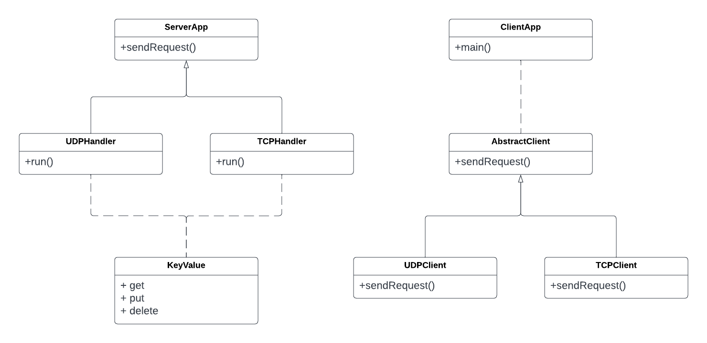

## Excutive Summary:

### 1. Assignment Overview:
The purpose of this assignment was to develop a Key-Value data store capable of handling both TCP and UDP protocols. The inclusion of both TCP, known for its reliability and connection-oriented nature, and UDP, recognized for its low latency and connectionless communication, served to underscore the differences in network protocol behaviors and their appropriate use cases. It combined an enlightening approach to use Java and implement foundational concepts of networking within the context mimicking a real-world application. Overall, the primary objective was to better understand the application of TCP and UDP within the confines of a client-server architecture. The task encompassed the development of a robust client-server model capable of executing basic operations like PUT, GET, and DELETE on stored data, with the server running indefinitely until externally terminated. In addition, this included the development of a robust client capable of interacting with the server using command-line arguments to specify the hostname/IP, port, and protocol. This setup aimed to mirror real-world applications, stressing the importance of understanding, and implementing two distinct Layer 4 communication protocols within the same application framework. This exercise emphasizes not just the technical implementation but also the reliability and error handling in network communication, such as managing timeouts and dealing with malformed packets, thereby demonstrating the complexities of building networked systems in a professional setting. These practices help ensure data integrity, consistency, and reliability through error handling, and adherence to best practices in data management and communication protocols, which will be paramount in scalable network applications.

### 2. Technical Impression:
The process of developing a single-server, key-value store capable of operating over both TCP and UDP protocols presented an intriguing blend of challenges and insights into network programming's nuances. Having come from a background with little Java and networking experience, I found this assignment to be extremely useful. This assignment was an effective exercise in applying theoretical knowledge to a practical scenario, necessitating a deep dive into Java's networking capabilities. My approach was to architect a flexible system comprising a client-server architecture that could seamlessly switch between the two protocols, emphasizing code reusability and modular design. I implemented a ClientApp class, that implemented a TCPClient and UDPClient that were abstracted from AbstractClient class. From a server perspective, I implemented a TCPHandler and UDPHander classes. This decision led to the creation of a cohesive codebase where TCP and UDP functionalities shared common logic for handling key-value operations, while protocol-specific details were encapsulated within their respective modules.

One of the most enlightening aspects of this project was grappling with the inherent differences between TCP and UDP. Designing a robust communication protocol that could accommodate both the reliable, connection-oriented nature of TCP and the connectionless, potentially lossy characteristics of UDP was challenging. It required careful consideration of error handling, especially for UDP, where packet loss and ordering could not be taken for granted. Implementing a timeout mechanism for the client was another critical feature, highlighting the real-world necessity of dealing with network unreliability. Crafting this mechanism to gracefully handle server unresponsiveness without disrupting the user experience was a valuable lesson in building fault-tolerant systems.

Additionally, the project underscored the importance of data integrity and validation. Devising a protocol to ensure that key-value pairs were accurately transmitted, received, and processed called for a meticulous design, particularly in parsing and handling requests. I found this to be challenging having had little Java experience prior to this assignment. It was very intriguing to learn how to apply this effectively. Encountering and resolving issues related to malformed packets and unexpected server behavior reinforced the need for comprehensive testing and validation strategies. This aspect of the project was a stark reminder of the complexities involved in network communication and the critical role of rigorous testing in developing reliable applications.

The most interesting part of this assignment at its core was using the Runnable class within Java, specifically in the ServerApp class, to implement two threads: one for TCP Handler and another for the UDP Handler. It took a considerable amount of time to understand the theory and language enough to create the sockets and foundational logic to implement the capability. In the end, it was rewarding to see theory translate to application. This project not only enhanced my technical skills in Java and network programming but also deepened my appreciation for the intricacies of building scalable, distributed systems. I look forward to expanding this code base further as we dive deeper into distributed systems.

### 3. Use Case / Application:

One example of a practical application of this system is in the field I currently work within: the pharmaceutical manufacturing domain. This could be applied within a manufacturing perspective, specifically for Internet of Things (IoT) in which multiple systems transmit data within the network to a centralized server. TCP can be used for applications where data integrity and delivery are crucial such as for data regulated by the FDA. On the other hand, UDP can be used for non-critical data flow in which speed is prioritized over reliability.
